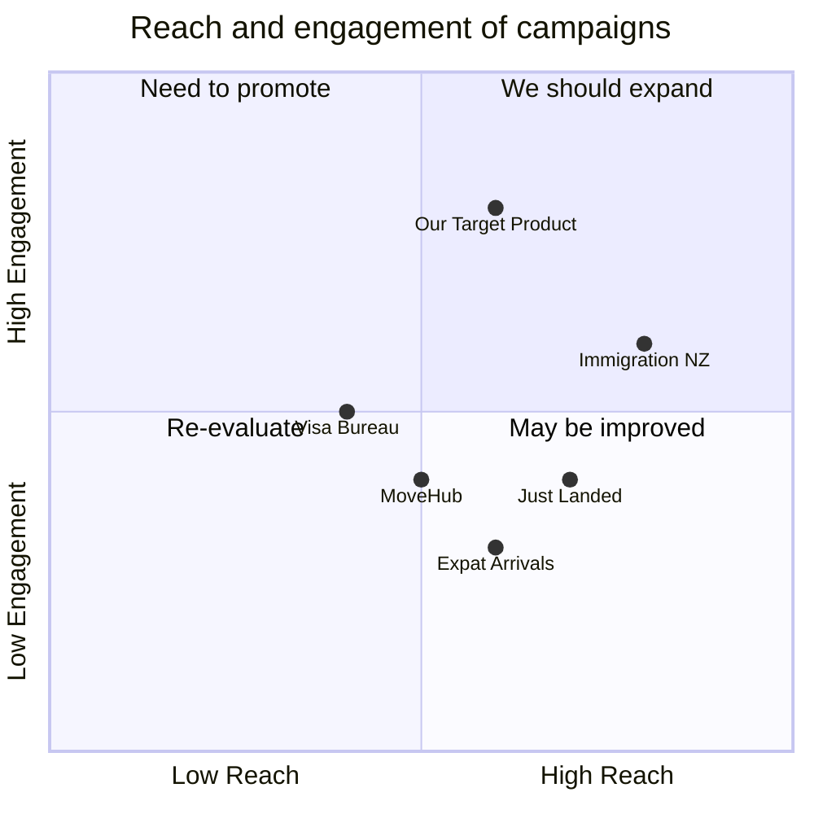

## Original Requirements
The boss has requested the creation of an AI Agent based on the OpenAI API. This AI Agent should be capable of answering New Zealand immigration questions and creating immigration plans.

## Product Goals
```python
[
    "Create an AI Agent that can accurately answer New Zealand immigration questions",
    "The AI Agent should be able to create personalized immigration plans",
    "Ensure the AI Agent is user-friendly and accessible to a wide range of users"
]
```

## User Stories
```python
[
    "As a user, I want to ask the AI about the immigration process in New Zealand so that I can understand the steps involved",
    "As a user, I want the AI to provide me with a personalized immigration plan so that I can prepare for my move",
    "As a user, I want to be able to interact with the AI easily and intuitively so that I can get the information I need without confusion",
    "As a user, I want the AI to provide accurate and up-to-date information so that I can trust the advice it gives",
    "As a user, I want the AI to understand my specific situation and provide relevant advice so that I can make informed decisions about my immigration process"
]
```

## Competitive Analysis
```python
[
    "Immigration NZ: Official website providing comprehensive immigration information, but lacks personalized advice",
    "Just Landed: Provides general advice and guides for immigrating to various countries, including New Zealand, but does not offer personalized plans",
    "Expat Arrivals: Offers guides and articles about moving to New Zealand, but lacks an interactive AI feature",
    "MoveHub: Provides general advice and resources for moving to different countries, but lacks specific, detailed information about New Zealand immigration",
    "Visa Bureau: Offers New Zealand immigration services and advice, but does not have an AI feature for instant, personalized advice"
]
```

## Competitive Quadrant Chart


## Requirement Analysis
The product should be an AI Agent that can interact with users to answer their New Zealand immigration questions and create personalized immigration plans. It should be user-friendly, intuitive, and provide accurate, up-to-date information. 

## Requirement Pool
```python
[
    ("AI Agent should be able to answer a wide range of New Zealand immigration questions", "P0"),
    ("AI Agent should be able to create personalized immigration plans based on user input", "P0"),
    ("AI Agent should be user-friendly and intuitive", "P0"),
    ("AI Agent should provide accurate, up-to-date information", "P0"),
    ("AI Agent should be able to understand user's specific situation and provide relevant advice", "P1")
]
```

## UI Design draft
The AI Agent will be presented in a chat interface, similar to a messaging app. Users can type their questions into a text box and the AI Agent will respond in a conversational manner. The interface should be clean and minimalistic, with a focus on readability. The color scheme should be calming and trustworthy, such as a combination of white, blue, and grey.

## Anything UNCLEAR
There are no unclear points.