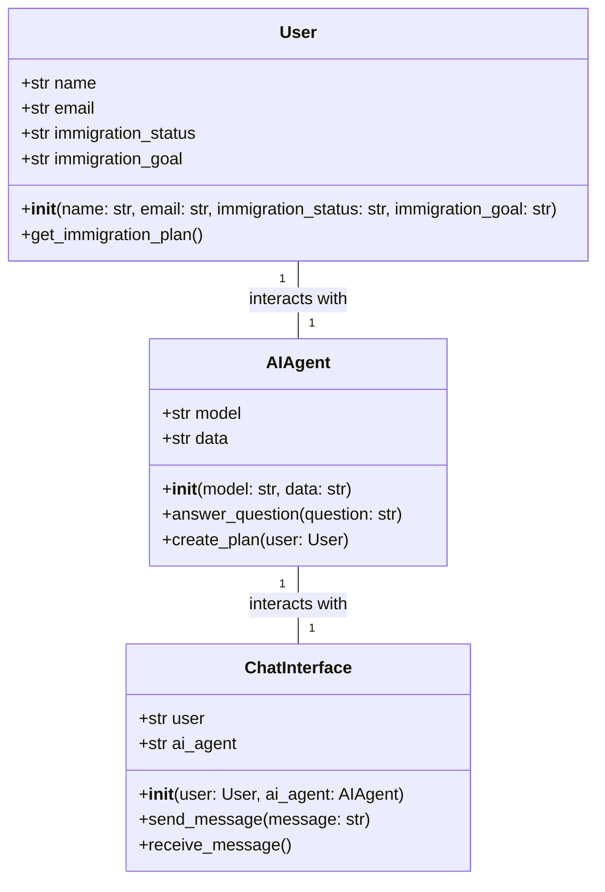
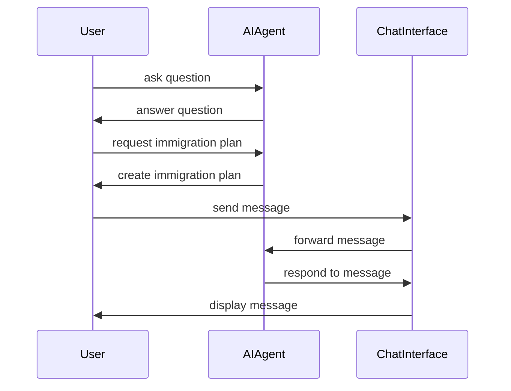

## Implementation approach
The AI Agent will be implemented using Python, Flask for the web interface, and OpenAI's GPT-3 for the AI model. We will use an open-source chatbot UI framework to create an intuitive and user-friendly chat interface. The AI Agent will be trained to understand and answer a wide range of New Zealand immigration questions and to create personalized immigration plans based on user input. We will use the official New Zealand immigration website and other reliable sources to ensure the AI Agent provides accurate and up-to-date information.

## Python package name
```python
"nz_immigration_ai"
```

## File list
```python
[
    "main.py",
    "ai_agent.py",
    "chat_interface.py",
    "immigration_data.py",
    "user.py"
]
```

## Data structures and interface definitions


## Program call flow


## Anything UNCLEAR
The requirement is clear to me.